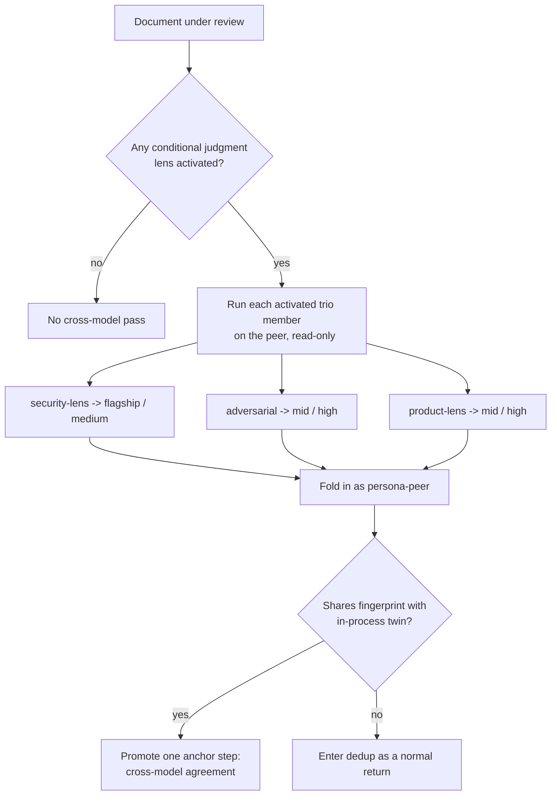

# Cross-Model Adversarial Review for ce-doc-review - Plan

## Goal Capsule

- **Objective:** Give ce-doc-review a cross-model pass that mirrors ce-code-review's design — run the conditional judgment lenses through a different model family so cross-model agreement promotes findings a single model would miss.
- **Product authority:** Repo maintainer (product decisions confirmed in brainstorm).
- **Execution profile:** Standard, software. Additive to an existing skill: one new script, one new reference, and wiring edits to `ce-doc-review`'s SKILL.md and synthesis reference. No converter or parser changes.
- **Open blockers:** None. One implementation-time detail is deferred (how "high reasoning" is expressed on the Claude peer CLI).
- **Product Contract preservation:** Product Contract unchanged — this enrichment adds Planning Contract, Implementation Units, Verification, and Definition of Done without altering any R-ID.

---

## Product Contract

### Summary

Add a cross-model pass to ce-doc-review that mirrors ce-code-review's design: whichever of the conditional judgment trio — `adversarial-document-reviewer`, `product-lens-reviewer`, `security-lens-reviewer` — activated for a document also runs on a different model family in a read-only process, folding in as `<reviewer-name>-<peer>` where agreement with its in-process twin promotes the finding. The peer is tiered per lens, and the pass runs in both interactive and headless modes.

### Problem Frame

ce-doc-review's judgment lenses run on a single model, so their blind spots are the host model's blind spots — a premise it won't question, a threat class it doesn't know, a strategic claim it won't challenge. ce-code-review already closes this gap for its adversarial lens by running a second, different-family model and treating cross-model agreement as its strongest promotion signal. Running the same review through another model manually on documents has reliably surfaced issues the single-model pass missed — the same motivation, confirmed in practice. ce-doc-review differs from code-review in one way that shapes the port: its value is spread across several judgment lenses rather than concentrated in one, so a faithful adversarial-only mirror would leave most of the cross-model upside unclaimed.

### Key Decisions

- **Mirror code-review's mechanism, not only its idea.** Reuse the proven shape — same persona brief handed to the peer, same findings schema, fold-in as a distinct `<reviewer-name>-<peer>` reviewer, read-only peer, non-blocking self-bounding execution. ce-doc-review gets its own script (skills are self-contained units), but the design is the established one, not a new invention.
- **Trio, not adversarial-only.** The cross-model pass covers the three conditional judgment lenses (`adversarial`, `product-lens`, `security-lens`) — the lenses whose output diverges most across model families, where agreement therefore carries real signal. The convergent lenses gain little from a second opinion.
- **feasibility excluded to preserve the conditional cost profile.** `feasibility-reviewer` is judgment-heavy but always-on; including it would spawn the peer on every single review. Excluding it keeps the pass targeted to documents that activate a conditional judgment lens.
- **Peer tiered per lens by the lever the lens rewards.** `security-lens` is knowledge-bound — flagship model breadth catches threat classes a mid model does not know exist — so it runs on the flagship at medium reasoning. `adversarial` and `product-lens` are reasoning-bound — deliberation, not world-knowledge, is the lever — so they run on a mid-capability model at high reasoning. This mirrors ce-doc-review's existing per-persona model tiering.
- **Model identity is a principle, not a pin.** A cross-model pass inherently names a concrete different family (code-review's script already pins one), but concrete IDs go stale. The contract is the tier + reasoning level; the concrete IDs below are the current instance and a documented maintenance point.

### Requirements

**Scope and activation**

- R1. The cross-model pass covers the conditional judgment trio — `adversarial-document-reviewer`, `product-lens-reviewer`, `security-lens-reviewer` — running each activated member through a different model family in a separate read-only process.
- R2. A trio member runs cross-model only when it is activated for the document under ce-doc-review's existing persona-activation logic. No new activation triggers are introduced, so a routine document that activates no trio member gets no cross-model pass.
- R3. `feasibility-reviewer`, `coherence-reviewer`, `scope-guardian-reviewer`, and `design-lens-reviewer` do not run cross-model.

**Peer model tiering**

- R4. `security-lens` runs on the peer at flagship model tier, medium reasoning. Current mapping: `gpt-5.6-sol` at medium.
- R5. `adversarial` and `product-lens` run on the peer at mid-capability model tier, high reasoning. Current mapping: `gpt-5.6-terra` at high (codex peer); the symmetric mid Claude tier at commensurate high effort when Claude is the peer.
- R6. Peer model and reasoning are specified as a tier-plus-reasoning principle. The concrete IDs in R4 and R5 are the current instance and a maintenance point, not the contract.

**Peer selection and fold-in**

- R7. Host and peer are chosen by runtime self-identification, reusing code-review's logic: Claude and Cursor prefer the codex peer, Codex prefers the claude peer; an unknown host skips the pass silently.
- R8. Each cross-model result folds into synthesis as reviewer `<reviewer-name>-<peer>`, entering dedup and promotion exactly like an in-process reviewer return.
- R9. A cross-model finding that shares a dedup fingerprint with its in-process twin (`<reviewer-name>`) promotes by one anchor step — the cross-model agreement signal.

**Execution and safety**

- R10. The peer runs strictly read-only and cannot mutate the repository, mirroring code-review's peer guarantees (hard sandbox for codex; denied mutators, MCP writes, and subagents for claude).
- R11. The pass is non-blocking and self-bounding. Any failure — no peer, CLI missing or unauthenticated, timeout, or unparseable output — logs a reason and produces no fold-in. It never fails the review; a missing result is simply "no cross-model pass."
- R12. The pass runs in both interactive and headless modes. On an interactive host it announces prominently, naming the peer and that the judgment lenses are running cross-model; in headless mode it runs silently.
- R13. The peer receives the document content plus the `document_type` and `origin` context slots the in-process persona adapts on, so its behavior matches the in-process reviewer rather than misfiring on a re-classification.

### Scope Boundaries

- `feasibility-reviewer` and the convergent lenses (`coherence`, `scope-guardian`, `design-lens`) stay single-model.
- No changes to ce-code-review's existing cross-model pass.
- Rejected in brainstorm: adversarial-only (too narrow for doc-review's spread of judgment value) and a full second-model review of every activated persona (over-scoped and expensive). Both remain future options if the trio under- or over-delivers.

### Success Criteria

- On documents that activate a trio member, the pass surfaces or promotes judgment findings the single-model reviewers missed, with cross-model agreement rendered as the promotion signal.
- The pass adds no new failure mode: a review where the peer is unavailable, errors, or times out completes exactly as it does today.
- The pass costs nothing on documents where no conditional judgment lens activates.

### Dependencies / Assumptions

- The peer CLI (`codex` or `claude`) must be installed and authenticated on the host. Absence is a clean skip, not an error.
- The GPT-5.6 family IDs (`sol`, `terra`) and the Claude mid-tier are current instances of the tier principle; revisit them as model families update.
- Reuses ce-doc-review's existing missing-document gate — Phase 1 confirms the document is readable on disk before any dispatch — so the peer can read the on-disk document without a diff or base ref.
- **Third-party data-egress trust boundary.** When a trio lens activates, the full document content is embedded in the peer prompt and sent to an external model provider (OpenAI for the codex peer, Anthropic for the claude peer). This is a wider egress than code-review's codex peer, which fetches its own diff in-sandbox. A document containing pasted secrets or proprietary content therefore leaves the machine — and in headless mode the pass runs silently with no disclosure. U1 (announce rules) and U5 (docs) must state this boundary; the headless-silent path should still emit a one-line log that content was sent cross-model, so the egress is auditable. Impact is bounded to disclosure, not repo compromise, by the read-only peer (R10), but a document from an untrusted author is also a prompt-injection surface (the read-only sandbox contains it to disclosure-to-self, not mutation).

---

## Planning Contract

### Key Technical Decisions

- **KTD1. One peer invocation per activated persona, not a combined call.** Per-lens model tiering (R4/R5 — flagship for security, mid for adversarial/product) cannot be expressed in a single combined peer call, which would carry one model. Each activated trio persona gets its own peer invocation with its own model/reasoning, its own persona brief, and its own `<reviewer-name>-<peer>.json` return. This resolves the brainstorm's open invocation-shape question. Cost is bounded by R2's conditional gate — most documents activate zero or one trio member.
- **KTD2. A doc-review-specific script, adapted from code-review's, not shared.** Per the repo's self-contained-skill rule (skills own their files; no cross-skill imports), the new script lives under `skills/ce-doc-review/scripts/` and self-locates its own personas and schema via `BASH_SOURCE`. It is modeled on `skills/ce-code-review/scripts/cross-model-adversarial-review.sh` but adapted for documents (see KTD3) and generalized over a persona-name argument.
- **KTD3. Document delivery replaces diff delivery.** code-review threads a diff to the peer (codex fetches it in-sandbox; claude gets it embedded). doc-review's subject is a document already readable on disk (guaranteed by Phase 1's missing-document gate). The peer prompt embeds the document content plus the `document_type` and `origin` context slots directly — no base ref, no `git diff`, and no per-peer read/embed split — the content is embedded for **both** peers. codex's read-only sandbox is a safety property, not the delivery path.
- **KTD4. Fold-in reuses the existing cross-persona agreement promotion (synthesis 3.4).** doc-review synthesis already promotes a merged finding by one anchor step when 2+ independent personas share its fingerprint. A `<reviewer-name>-<peer>` return counts as an independent persona, so agreement with the in-process `<reviewer-name>` promotes exactly as designed. The only synthesis change is to name this explicitly and render the Reviewer column as `<reviewer-name>, <reviewer-name>-<peer> (+1 anchor)`.
- **KTD5. Distinct persona-file vs reviewer-name, plus soft-array backfill.** The doc-review findings schema top-level is `{reviewer, findings, residual_risks, deferred_questions}` (note `deferred_questions`, where code-review has `testing_gaps`). The script self-locates the persona brief from `references/personas/<persona-file>.md` (full basename, e.g. `adversarial-document-reviewer`) but forces the fold-in `reviewer` field to `<reviewer-name>-<peer>` (the short name the in-process persona emits — `adversarial`, `product-lens`, `security-lens` — per the mapping table). The two are passed as separate arguments; conflating them into one token breaks either persona-file resolution or the fold-in fingerprint match. The script also backfills `residual_risks`/`deferred_questions` to `[]` when the peer omits them, dropping the file if `findings` is not an array.

### Host/Peer and Model Mapping

Runtime self-identification (reused from code-review's cross-model reference): Claude and Cursor hosts → `codex` peer; Codex host → `claude` peer; unknown host → skip silently.

| Persona file | Reviewer name | Lever | Codex peer (current) | Claude peer (current) |
|---|---|---|---|---|
| `security-lens-reviewer` | `security-lens` | knowledge-bound | `gpt-5.6-sol`, reasoning medium | `opus`, medium effort |
| `adversarial-document-reviewer` | `adversarial` | reasoning-bound | `gpt-5.6-terra`, reasoning high | `sonnet`, high effort |
| `product-lens-reviewer` | `product-lens` | reasoning-bound | `gpt-5.6-terra`, reasoning high | `sonnet`, high effort |

The concrete IDs are the current instance of the tier principle (R6), centralized in one mapping in the script so the maintenance point is a single edit site. On the Claude peer the model tier is the sole differentiator — the `claude -p` CLI has no codex-style `model_reasoning_effort` flag (see Assumptions) — so the flagship-vs-mid model choice is what carries the security-vs-reasoning split. **Persona file vs reviewer name are distinct columns:** the script resolves the persona brief from `references/personas/<persona-file>.md` but forces the fold-in reviewer field to `<reviewer-name>-<peer>`, where `<reviewer-name>` is the short name the in-process persona emits (so agreement matches — see KTD5, U2, U4). The two are not interchangeable: `adversarial-document-reviewer` is the file; `adversarial` is the reviewer name.

### Assumptions

- Codex reasoning effort is set via `-c model_reasoning_effort=<level>` and the model via `-m <id>`, following the existing code-review script's codex invocation.
- The Claude peer differentiates by model tier alone (`opus` for security-lens, `sonnet` for adversarial/product) because the `claude -p` CLI has no codex-style `model_reasoning_effort` flag; if a build-time effort lever exists it is applied, but the tier is the guaranteed differentiator.
- The cross-model pass does not thread `{decision_primer}` to the peer. Harmless for round-1 cross-model; in a round-2+ interactive session the peer would not honor prior-round rejections the in-process personas suppress. Deferred to implementation — acceptable because cross-model is most valuable on round 1, and synthesis's own R29/R30 suppression still applies to the folded-in findings.

---

## Implementation Units

### U1. Cross-model reference for ce-doc-review

- **Goal:** The orchestrator-facing reference that decides whether the pass runs, which peer, per-lens tiering, and how results fold in — the doc-review analog of `skills/ce-code-review/references/cross-model-review.md`.
- **Requirements:** R1, R2, R3, R6, R7, R8, R9, R11, R12.
- **Dependencies:** none.
- **Files:** `skills/ce-doc-review/references/cross-model-review.md` (new).
- **Approach:** Mirror the structure of code-review's cross-model reference, adapted: (1) Gates — run only when at least one trio member (`adversarial-document-reviewer`, `product-lens-reviewer`, `security-lens-reviewer`) was activated in Phase 1, and the document is readable on disk (already guaranteed by Phase 1's missing-document gate; no remote-scope skip needed since there is no diff). (2) Host/peer runtime self-id (copy code-review's Step 1 union-of-env-markers logic). (3) Per-lens peer tiering table (from Planning Contract). (4) Invocation — launch one background script call per activated trio member in the same dispatch wave as the in-process reviewers (KTD1), collect before synthesis. (5) Announce rules — interactive host: one prominent line naming the peer and that the judgment lenses run cross-model; headless: no user-facing prose, but emit a one-line audit log that document content was sent cross-model to the named peer provider (the egress is silent to the user otherwise — see the third-party data-egress trust boundary). (6) Fold-in — read each `<reviewer-name>-<peer>.json`; a present file is one independent reviewer return entering synthesis 3.3/3.4; a missing file is "no cross-model pass" (never a failure). Anchor the script invocation with the `SKILL_DIR` pattern per the repo's tier-3 executed-shell convention.
- **Patterns to follow:** `skills/ce-code-review/references/cross-model-review.md` (section shape, announce contract, non-blocking language, SKILL_DIR anchor).
- **Test scenarios:** `Test expectation: none — orchestrator-facing prose reference. Behavioral correctness is validated by the U6 skill-creator eval, not bun test.`
- **Verification:** The reference states each gate, the tiering table, the announce rules, and the fold-in contract; a reader can determine when the pass runs and how a return merges without opening the script.

### U2. Cross-model script for ce-doc-review

- **Goal:** The bundled script that runs one trio persona through the peer, read-only, and writes a schema-shaped return.
- **Requirements:** R1, R4, R5, R6, R7, R10, R11, R13; KTD1, KTD2, KTD3, KTD5.
- **Dependencies:** U1 (defines the invocation contract the script implements).
- **Files:** `skills/ce-doc-review/scripts/cross-model-doc-review.sh` (new).
- **Approach:** Adapt `skills/ce-code-review/scripts/cross-model-adversarial-review.sh`. Signature: `cross-model-doc-review.sh <peer> <persona-file> <reviewer-name> <document-path> <document-type> <origin> <run-dir>` — `<persona-file>` and `<reviewer-name>` are distinct (KTD5). Self-locate `references/personas/<persona-file>.md` and `references/findings-schema.json` via `BASH_SOURCE`. Compose the peer prompt from the persona brief + a JSON-only contract carrying the embedded findings schema + a `<review-context>` block with `Document type:`, `Document path:`, `Origin:`, and the embedded document content (KTD3, R13). Resolve the per-lens model + reasoning from a single in-script mapping keyed on `<reviewer-name>` (R4/R5/R6). Run read-only per peer: codex `-s read-only -m <model> -c model_reasoning_effort=<level>` with the streaming idle/hard watchdog and process-group reap; claude `-p --model <model> --permission-mode dontAsk --disallowedTools Edit Write NotebookEdit Bash Task 'mcp__*' --max-turns 15 --no-session-persistence --json-schema <doc-review-schema> --output-format json` with the hard-cap timeout (R10 — carry `--max-turns`/`--no-session-persistence` from the reference for loop-bounding and no on-disk session state). Write `<run-dir>/<reviewer-name>-<peer>.json`. Normalize: force `reviewer = <reviewer-name>-<peer>`, backfill `residual_risks`/`deferred_questions` to `[]`, drop the file when `findings` is not an array (KTD5). Non-blocking throughout: every failure logs and `exit 0` with no output file (R11).
- **Patterns to follow:** the code-review script's watchdog/reap, per-peer read-only split, stdout-recovery fallback, and reviewer-name normalization — reused near-verbatim; the diff-fetch block is replaced by document embedding.
- **Test scenarios:**
  - Covers R11. Invalid peer (`''`, `foo`) → logs skip reason, exits 0, writes no file.
  - Covers R11. Missing persona file or missing schema → skip, exit 0, no file.
  - Covers R11. Peer CLI absent on `PATH` → skip, exit 0, no file.
  - Covers R13/KTD5. Given a canned peer stdout JSON with `reviewer:"adversarial"` and no `residual_risks`, the normalization step rewrites `reviewer` to `<reviewer-name>-<peer>` and backfills `residual_risks`/`deferred_questions` to `[]` (verifiable with `jq` against a fixture, no live model call).
  - Covers KTD5. Peer output whose `findings` is not an array → output file is dropped (clean skip).
  - `Execution note:` The live codex/claude invocations cannot run in CI; exercise the input-validation, skip, and JSON-normalization paths with stubbed input, and defer end-to-end peer behavior to the U6 skill-creator eval.
- **Verification:** `bash cross-model-doc-review.sh` with each invalid/missing input exits 0 and writes no file; a fixture stdout JSON normalizes to the exact `{reviewer, findings, residual_risks, deferred_questions}` shape with the forced reviewer name.

### U3. Wire the pass into ce-doc-review SKILL.md

- **Goal:** Dispatch the cross-model pass in Phase 2 and fold its returns into Phases 3-5, gated on trio activation, in both modes.
- **Requirements:** R1, R2, R7, R8, R12, R13.
- **Dependencies:** U1, U2.
- **Files:** `skills/ce-doc-review/SKILL.md`.
- **Approach:** In Phase 2 (Dispatch), after persona selection: when at least one trio member was activated, load `references/cross-model-review.md` and launch one background script invocation per activated trio member in the same dispatch wave as the in-process reviewers, passing `document_type` (from Phase 1 classification), the document path, and `origin` (the same `{origin_path}` slot the in-process personas receive — R13). Add the announce line per U1 (interactive: prominent, names peer + judgment-lens cross-model coverage; headless: silent — R12). In the Phase 2 dispatch-limit note, clarify the script calls are CLI shell-outs that do not consume the subagent concurrency budget. In Phases 3-5, add the collect-and-fold step: before synthesis, read each `<reviewer-name>-<peer>.json` and treat a present file as an independent reviewer return entering the existing synthesis pipeline. Do not duplicate synthesis mechanics here — point to `references/synthesis-and-presentation.md` (U4).
- **Patterns to follow:** code-review SKILL.md Stage 3 announce (line ~397) and Stage 4 launch (line ~550) prose; ce-doc-review's existing Phase 2 dispatch and Phases 3-5 handoff structure.
- **Test scenarios:** `Test expectation: none — SKILL.md orchestration prose. Behavioral wiring (does the pass fire on the right activation, in both modes) is validated by the U6 skill-creator eval, per AGENTS.md "Validating Agent and Skill Changes".`
- **Verification:** SKILL.md instructs launching the pass only when a trio member activated, threads `document_type`/`origin`, announces per mode, and folds returns into synthesis via the reference — with no cross-model mechanics inlined that would drift from U1/U4.

### U4. Name the cross-model return in synthesis fold-in

- **Goal:** Make explicit that a `<reviewer-name>-<peer>` return is an independent persona whose agreement with the in-process `<reviewer-name>` promotes by one anchor step.
- **Requirements:** R8, R9; KTD4.
- **Dependencies:** none (independent of U1-U3; edits the synthesis reference).
- **Files:** `skills/ce-doc-review/references/synthesis-and-presentation.md`.
- **Approach:** In the cross-persona dedup (3.3) and agreement-promotion (3.4) steps, add that a cross-model `<reviewer-name>-<peer>` return counts as an independent persona for fingerprint matching and the one-anchor-step promotion, and that agreement between it and the in-process `<reviewer-name>` is the strongest signal in the set (different model families, separate processes). Specify the Reviewer-column rendering: `<reviewer-name>, <reviewer-name>-<peer> (+1 anchor)`. Keep the existing promotion mechanic — this is a naming/attribution clarification, not a new rule (KTD4).
- **Patterns to follow:** code-review SKILL.md Stage 5 step 3 (line ~573) treatment of `adversarial-<peer>` as an independent reviewer with the strongest-signal note.
- **Test scenarios:** `Test expectation: none — synthesis prose reference. Validated by the U6 skill-creator eval (fold-in + promotion behavior).`
- **Verification:** Steps 3.3 and 3.4 state that `<reviewer-name>-<peer>` returns participate as independent personas, promote agreement by one anchor step, and render as `<reviewer-name>, <reviewer-name>-<peer> (+1 anchor)`.

### U5. Documentation

- **Goal:** Reflect the new capability in user-facing docs.
- **Requirements:** advances the plan's stated behavior; no product R directly.
- **Dependencies:** U1-U4 (describe shipped behavior).
- **Files:** `docs/skills/ce-doc-review.md`; `README.md` (ce-doc-review inventory row, if it describes capabilities).
- **Approach:** Add a cross-model section to `docs/skills/ce-doc-review.md` mirroring the treatment in `docs/skills/ce-code-review.md` — what the pass does, which lenses it covers, per-lens tiering rationale, non-blocking/read-only, both modes, and the third-party data-egress trust boundary (document content is sent to the peer model provider when the pass runs). Update the README inventory row only if it summarizes doc-review's review coverage. No skill/agent/command count changes (this adds files to an existing skill), so no `tests/release-metadata.test.ts` count bump.
- **Patterns to follow:** the cross-model prose already in `docs/skills/ce-code-review.md`.
- **Test scenarios:** `Test expectation: none — documentation only.`
- **Verification:** `docs/skills/ce-doc-review.md` describes the cross-model pass; README stays consistent.

### U6. Skill-creator eval for the cross-model wiring

- **Goal:** Author and run the skill-creator eval that is the load-bearing behavioral gate — `bun test` does not exercise SKILL.md/reference prose, so this eval is the only validation of the behavioral wiring.
- **Requirements:** validates R1, R2, R7, R8, R9, R12, R13 behaviorally; no product R of its own.
- **Dependencies:** U1, U2, U3, U4 (the behavior it exercises).
- **Files:** the skill-creator eval definition for ce-doc-review's cross-model pass (author via the `skill-creator` skill's eval workflow; store per that skill's convention).
- **Approach:** Use the `skill-creator` skill to build an eval that injects the edited ce-doc-review skill/reference content at dispatch time (so it reads current source, not the session-cached copy — AGENTS.md "Validating Agent and Skill Changes"). The eval asserts: the pass fires only when a trio member activated and never otherwise (R1, R2); host/peer self-id resolves correctly (R7); `document_type` and `origin` reach the peer (R13); a `<reviewer-name>-<peer>` return folds in and agreement promotes by one anchor step (R8, R9); interactive announces and headless stays silent (R12).
- **Test scenarios:** the eval cases above ARE the test scenarios. `Execution note:` this is a validation deliverable, not runtime code — its "tests" are its eval assertions, run via skill-creator.
- **Verification:** the skill-creator eval passes on the current source; a routine validated-upstream plan with no trio activation triggers no peer call.

---

## Verification Contract

| Gate | Command | Applies to | Done signal |
|---|---|---|---|
| Test suite unaffected | `bun test` | U2-U5 | Green — no converter/parser surface touched, so no regressions expected |
| Metadata consistency | `bun run release:validate` | U1-U5 | Passes — additive files to an existing skill, no count/description drift |
| Script skip paths | `bash skills/ce-doc-review/scripts/cross-model-doc-review.sh` with invalid/missing inputs | U2 | Exit 0, no output file, logged reason |
| Script normalization | run the script's normalization over a fixture stdout JSON via `jq` | U2 | Output is exactly `{reviewer:"<reviewer-name>-<peer>", findings, residual_risks, deferred_questions}` |
| Behavioral wiring | `skill-creator` eval on ce-doc-review (activation gate, both modes, per-lens dispatch, fold-in + promotion) — authored/run by U6 | U1, U2, U3, U4 | Eval confirms the pass fires on trio activation only, threads context slots, and promotes on cross-model agreement |

The skill-creator eval is the load-bearing behavioral gate: `bun test` does not exercise SKILL.md/reference prose, and plugin skill definitions cache at session start, so in-session dispatch tests pre-edit content (AGENTS.md "Validating Agent and Skill Changes").

---

## Definition of Done

- The cross-model pass runs one peer invocation per activated trio member, gated on that member's existing activation (R1, R2), and never on the excluded lenses (R3).
- Per-lens peer tiering is applied from a single in-script mapping (R4, R5, R6).
- Host/peer self-id, read-only execution, and non-blocking self-bounding behavior match code-review's guarantees (R7, R10, R11).
- Each return folds in as `<reviewer-name>-<peer>` and promotes by one anchor step on agreement with its in-process twin (R8, R9, KTD4).
- The pass runs and announces correctly in both interactive and headless modes, threading `document_type` and `origin` to the peer (R12, R13).
- `bun test` and `bun run release:validate` pass; the script skip and normalization paths verify; the skill-creator eval confirms the behavioral wiring.
- Docs updated (U5).
