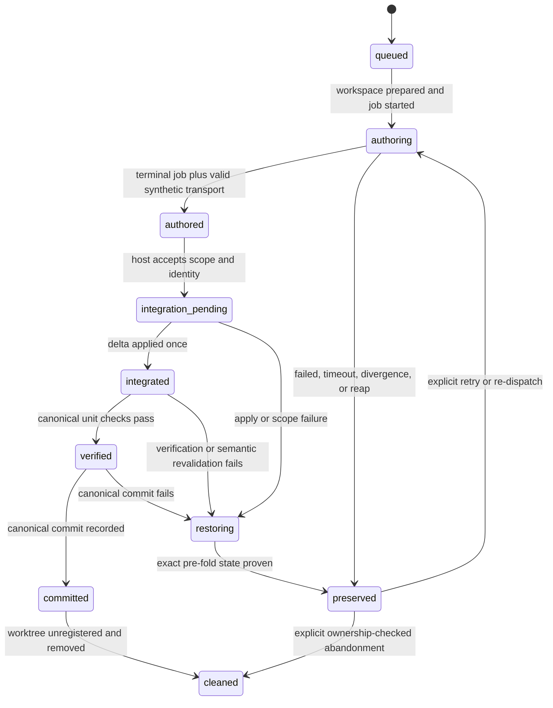

# CE Work Cross-Model Execution - Plan

## Goal Capsule

- **Objective:** Let `ce-work` route implementation units to another model or harness through a durable, isolated execution engine while preserving host-owned verification, commits, and shipping behavior.
- **Product authority:** The confirmed Plan C decisions in this session, the existing `ce-work` contract, and the portable skill-authoring field guide.
- **Open blockers:** None before implementation. U3 must produce at least one real end-to-end external write-route receipt before the feature can satisfy Definition of Done; if every candidate fails, implementation stops with that product blocker instead of shipping a dark engine.

---

## Product Contract

### Summary

Add a cross-model implementation engine to `ce-work`, with stage-scoped routing from direct invocations and automatic callers such as `lfg`. Independently running units execute in isolated workspaces with durable progress, while the host remains the sole integrator, verifier, and owner of canonical commits.

### Problem Frame

`ce-work` already owns implementation sequencing, worker dispatch, verification, and shipping across native execution engines. The cross-model foundations shipped for review and point-of-view workflows are read-only; they do not solve the longer-lived mutation, recovery, workspace, and integration problems of delegated implementation.

Long-running external workers can outlive a host tool call, leave partial edits, move Git state, or lose the user's routing intent when invoked through a larger workflow. Treating every implementation unit as isolated would avoid some risks but would also impose missing-dependency, patch-transport, cleanup, and visibility costs on ordinary synchronous host work.

The `ce-work` skill has also accumulated substantial protocol since its last structural review. Adding a new engine without reassessing its outcome spine, authority boundaries, conditional loading, and completion routes would compound that structure rather than ensure it remains portable across models and harnesses.

This deliberately revisits the capability once explored by the retired `ce-work-beta`, but not its token-arbitrage premise or foreground-polling implementation. Plan C treats cross-model access as an explicit capability choice, keeps delegation off by default, and uses the detached lifecycle specifically to avoid the turn and context burn documented for the beta. The live surface remains the existing `ce-work` skill; no retired skill name, configuration key, or automatic cost claim returns.

### Key Decisions

- **Cross-model execution is a fourth `ce-work` engine.** (session-settled: user-approved — chosen over a separate outsourcing skill: `ce-work` already owns unit sequencing, verification, commits, and caller-specific tails.)
- **Routing uses one mode plus a target and optional model.** (session-settled: user-approved — chosen over a host-by-target matrix and dual approval flags: runtime host attestation plus `off | prefer | require` expresses the portable policy with fewer conflicting controls.)
- **A one-run route is an implementation-only caller binding.** (session-settled: user-approved — chosen over committed plan metadata: routing is per-run or per-checkout authority and must not silently travel to another user or future checkout.)
- **One detached job owns one logical implementation unit.** (session-settled: user-directed — chosen over batch or whole-plan delegation: unit boundaries contain failure, recovery, verification, and commit scope.)
- **Externally delegated units use runner-managed detached worktrees under `/tmp/compound-engineering/ce-work/<run-id>/`.** (session-settled: user-approved — chosen over same-tree mutation: a stable external location keeps partial work out of the active checkout and remains inspectable across invocations.)
- **Workspace strategy is separate from engine and scheduling strategy.** (session-settled: user-approved — chosen over isolating every unit: synchronous host work keeps the active checkout, while every independent or concurrent worker requires isolation.)
- **Independent units may execute as bounded parallel waves.** (session-settled: user-approved — chosen over globally serial execution: parallel authoring can reduce elapsed time, while host-controlled sequential integration contains conflicts.)
- **The skill receives a bounded field-guide structural refresh.** (session-settled: user-directed — chosen over feature-only additions: major surgery should leave `ce-work` with a clear outcome spine and portable protocol, without authorizing unrelated cleanup.)

### Actors

- A1. **User/operator:** Invokes `ce-work` directly or supplies implementation-routing intent to a larger workflow.
- A2. **Caller workflow:** Invokes `ce-work` as an implementation stage and carries bounded authority and routing intent, such as `lfg` in return-to-caller mode.
- A3. **Host orchestrator:** Resolves the engine, schedules units, owns the active checkout, validates outputs, commits, and resumes the correct tail.
- A4. **Implementation worker:** Authors one bounded unit in the host session, a harness-managed workspace, or a runner-managed workspace.
- A5. **Target adapter:** Resolves a requested harness/model into one fixed executable route and reports the served identity and terminal result.

### Requirements

**Activation, routing, and authority**

- R1. `ce-work` must expose cross-model implementation as an execution engine without changing standalone or return-to-caller tail ownership.
- R2. A current-turn instruction must override a caller-carried binding, which must override per-checkout configuration, with native execution as the default when none applies.
- R3. Configuration must support `off`, `prefer`, and `require` modes with a target harness or model family and an optional model pin.
- R4. `prefer` must attempt the configured route in direct and automatic workflows, then continue natively with prominent requested-versus-actual disclosure when the route is unavailable.
- R5. `require` must ask whether to continue natively in an interactive workflow and return a blocker without prompting in a headless or automatic workflow when the route is unavailable.
- R6. A direct instruction such as "use Codex" must have preference strength unless the user adds a strict marker such as "must" or "only".
- R7. An automatic caller must carry implementation routing as a typed, implementation-only binding that planning and review stages do not consume.
- R8. The resolved one-run binding and its provenance must move into the durable execution manifest when `ce-work` begins, while durable standing preferences remain in gitignored per-checkout configuration.
- R9. `cursor` must mean the Cursor harness with its default model, while `composer` must mean a Composer-family model through Cursor; same-host default execution must collapse to native execution when no distinct serving route is requested.
- R10. The host must attempt the requested route first, adapt only within the permitted target/family when availability changes, and disclose every substitution or fallback without mislabeling the served model.
- R11. Every external route must be fixed and sanctioned before repository content or mutation authority leaves the host; the worker must never switch recipients internally.

**Workspace and detached-job lifecycle**

- R12. One detached external job must own exactly one logical implementation unit and receive only that unit's bounded plan packet and inherited authority.
- R13. Each external unit must start from a clean canonical checkout and a recorded unit-start SHA in a detached linked worktree beneath `/tmp/compound-engineering/ce-work/<run-id>/`.
- R14. The runner must keep durable ownership-checked state for route, workspace, progress, logs, requested and served identity, terminal result, and recovery location without holding a host tool call open for the worker's runtime.
- R15. Progress must surface at meaningful milestones, including the active unit, elapsed time, latest meaningful activity, terminal state, and verification outcome, without continuous transcript streaming or arbitrary mid-flight steering.
- R16. The worker may edit or commit inside its isolated workspace, but only the host may apply changes to the canonical checkout and create canonical commits.
- R17. Before fold-in, the host must confirm the canonical repository identity, cleanliness, and HEAD still match the unit-start contract; divergence must preserve the worker workspace and stop integration.
- R18. Successful workspaces must be removed only after host integration, verification, and commit; failed, timed-out, or divergent workspaces must remain inspectable until recovery or explicit ownership-checked cleanup.
- R19. Same-tree mutation by an external detached worker must not be a v1 fallback.

**Scheduling and integration**

- R20. Synchronous host-owned implementation may continue in the active checkout, while every independently running or concurrent worker must use an isolated workspace.
- R21. The host may schedule a bounded parallel wave only when the plan dependency graph, expected write scopes, shared contracts, generated surfaces, and runtime resources support independence.
- R22. Workers must not self-authorize parallel scope or silently broaden their write scope; discovered overlap must return to the host scheduler.
- R23. Parallel workers may author concurrently from one recorded wave base, but the host must integrate, verify, and commit their outputs sequentially.
- R24. A cleanly applied patch must not be treated as proof of semantic compatibility; each fold-in must revalidate the remaining wave against the advancing canonical state.
- R25. Unexpected textual or semantic overlap must trigger host resolution, unit re-dispatch on the new base, or serial fallback rather than blind merge.

**Skill structure, compatibility, and evidence**

- R26. The `ce-work` skill must be reviewed against the portable skill-authoring field guide, beginning with result, next consumer, done condition, and non-obvious intent before workflow detail.
- R27. The refresh must keep load-bearing routes and local gates inline, extract only substantial conditional or late-sequence content, and describe capabilities before harness-specific adapters.
- R28. Mutation and delegation authority must travel as bounded data that downstream workers may narrow but never broaden.
- R29. Existing native engines, plan discovery, unit verification, return-to-caller envelopes, shipping tails, and user permission settings must remain compatible unless this plan explicitly changes them.
- R30. Deterministic runner, routing, path-safety, lifecycle, integration, parity, and conversion contracts must be covered by repository tests, while skill reasoning changes must receive targeted fresh-context behavioral evaluation.
- R31. User-facing documentation and per-checkout configuration guidance must explain direct invocation, `lfg` propagation, mode semantics, target/model distinction, progress, recovery, and fallback behavior.
- R32. Durable run state must distinguish detached-process completion from integration, canonical verification, canonical commit, and cleanup, and resume must converge without duplicate dispatch or duplicate application.
- R33. A successful external attempt must yield a complete Git change set covering committed, uncommitted, untracked, deleted, renamed, mode-changed, and binary output; worker prose alone is never the transport.
- R34. Direct and automatic callers must receive the same requested-versus-actual route, model, fallback, run, unit, blocker, and recovery receipts, while preserving their different prompting and shipping-tail ownership.
- R35. Linked-worktree isolation must be described as same-user concurrency and accidental-mutation containment rather than a security sandbox; detected canonical-checkout mutation must block fold-in.
- R36. A target adapter must remain unavailable until an unattended, fixed-recipient, write-capable run in the supplied isolated workspace passes its capability contract.

**Security, transactional fold-in, and launch evidence**

- R37. Every external result must terminalize as one synthetic transport commit whose tree equals the worker's complete final tree and whose sole parent is the recorded unit or wave base, regardless of the worker's intermediate commits or residual dirt.
- R38. Canonical fold-in must use the synthetic transport commit without committing, run authoritative verification, and either create one host-owned canonical commit or restore the exact recorded pre-fold checkout before any next unit, fallback, or resume action.
- R39. When the resolved plan artifact is the only canonical dirt, the host must create and disclose a plan-only checkpoint commit before external execution; any unrelated dirt keeps the route unavailable and follows `prefer` or `require` behavior.
- R40. The run root and durable state must use a private umask, `0700` directories, and `0600` state files, with owner, type, link, and mode revalidation on resume before any state is trusted.
- R41. External adapters must use CLI-native authentication, must not accept secrets through prompts or argv, must receive a minimized environment, and must prevent credentials from entering persisted prompts, logs, manifests, or results.
- R42. Before egress, the host must disclose and durably record the sanction source, fixed route and every intermediary, repository or unit material exposed, and caller restrictions; a required restriction the adapter cannot enforce makes the route unavailable.
- R43. Every started route must have a hard runtime cap, while an idle cap may be enabled only when that route's capability receipt proves trustworthy incremental activity.
- R44. Feature completion requires at least one non-native external write route to pass the real disposable-repository capability matrix; unqualified candidates remain explicit unavailable stubs rather than production argv branches.
- R45. The generic runner's age sweep must be disabled for `ce-work` through a parity-preserved option while retaining the existing default for review-skill consumers.

### Key Flows

- F1. **Direct delegated implementation**
  - **Trigger:** A1 invokes `ce-work` with a named target or an active configured route.
  - **Actors:** A1, A3, A4, A5
  - **Steps:** A3 resolves and sanctions one route, creates a unit workspace, starts and supervises A4, validates the result, integrates it, and commits the unit.
  - **Outcome:** The requested target authors the unit when reachable, with native fallback or a blocker determined by intent strength.
  - **Covered by:** R1-R6, R9-R19, R37-R44
- F2. **Caller-propagated implementation**
  - **Trigger:** A1 tells A2 to use a named harness or model for implementation.
  - **Actors:** A1, A2, A3, A4, A5
  - **Steps:** A2 carries an implementation-only binding through earlier stages, passes it to `ce-work`, and receives the return-to-caller envelope after implementation and local verification.
  - **Outcome:** Routing intent survives the workflow without changing planning, review, or caller-owned shipping behavior.
  - **Covered by:** R1-R11, R28-R29, R34, R39, R42
- F3. **Parallel implementation wave**
  - **Trigger:** A3 finds multiple ready units that satisfy the independence gate.
  - **Actors:** A3, A4
  - **Steps:** A3 dispatches each unit to an isolated workspace from one wave base, receives results concurrently, then folds them into the canonical checkout one at a time with revalidation between commits.
  - **Outcome:** Independent authoring overlaps in time without giving workers canonical integration authority.
  - **Covered by:** R20-R25, R37-R38
- F4. **Failure and recovery**
  - **Trigger:** A4 fails, times out, changes unexpected scope, or returns after the canonical checkout diverges.
  - **Actors:** A1, A3, A4, A5
  - **Steps:** Durable state records the terminal condition, A3 prevents or transactionally unwinds fold-in, preserves the workspace, and applies the route's preference or requirement behavior.
  - **Outcome:** No failed or stale output remains in the canonical checkout, and the user receives an inspectable recovery path.
  - **Covered by:** R4-R5, R10-R19, R25, R37-R43

### Acceptance Examples

- AE1. **Covers R4, R7-R8.** Given an `lfg` prompt that says "use Codex" on a Claude host, when implementation begins and Codex is reachable, then only the `ce-work` implementation stage receives the Codex route and the run manifest records its provenance.
- AE2. **Covers R4-R6.** Given preference-strength Codex routing and an unreachable Codex CLI, when `ce-work` resolves the engine, then it continues with the native host and reports Codex as requested and native as actual.
- AE3. **Covers R5-R6.** Given `require` or "only use Codex" in an automatic workflow and an unreachable Codex route, when `ce-work` resolves the engine, then it returns a blocker without asking a question or starting native implementation.
- AE4. **Covers R13, R16-R18.** Given an external worker that commits inside its detached unit workspace, when it finishes successfully, then the host captures the complete change, verifies and commits it canonically, and removes the temporary worktree only afterward.
- AE5. **Covers R17-R18.** Given the canonical HEAD changes while a delegated unit runs, when the worker completes, then fold-in stops and its workspace and result remain available for recovery.
- AE6. **Covers R13, R19.** Given a dirty active checkout, when preference-strength external execution is requested, then the route is treated as unavailable and falls back natively with disclosure; requirement-strength execution asks or blocks according to caller mode.
- AE7. **Covers R20-R24.** Given two ready units with disjoint dependencies, write scopes, and shared contracts, when capacity permits, then they author concurrently in separate workspaces and integrate as separately verified canonical commits.
- AE8. **Covers R22-R25.** Given two parallel workers that unexpectedly change the same shared contract, when the host examines their actual outputs, then it does not blindly merge both and instead resolves, re-dispatches, or serializes the affected work.
- AE9. **Covers R9-R10.** Given a Cursor host and target `cursor` with no distinct model, when the route resolves, then execution remains native; given target `composer`, then the Cursor adapter requests a Composer-family model and reports the served identity.
- AE10. **Covers R20, R29.** Given an ordinary sequential unit with no external or independently running worker, when the host implements it synchronously, then it continues in the active checkout without creating a temporary worktree.
- AE11. **Covers R14-R18, R32.** Given a host restart after a worker publishes output but before fold-in, when `ce-work` resumes the matching run, then it reuses the completed attempt and does not dispatch or apply the unit twice.
- AE12. **Covers R4-R5, R14, R32.** Given a `prefer` route whose worker is still live but temporarily unreachable from the host, when supervision resumes, then native fallback does not start until that attempt reaches an authoritative terminal or reaped state.
- AE13. **Covers R16, R33.** Given a worker that creates an untracked binary, renames a file, deletes another, and leaves dirty edits after making a commit, when the attempt terminalizes, then one base-parented synthetic transport commit captures the complete semantic delta and the host inspects the same delta before canonical commit.
- AE14. **Covers R17, R23-R25, R32.** Given a parallel wave whose first unit has been committed canonically, when the host considers the next same-base result, then only those recorded host-owned wave commits may explain the advanced HEAD; unknown movement blocks, and clean application still requires semantic revalidation.
- AE15. **Covers R7-R8, R29, R34.** Given an `lfg` run that falls back from requested Codex to native Claude under `prefer`, when `ce-work` returns, then the envelope identifies the binding provenance, requested and actual routes/models, fallback reason, completed units, verification, and any recovery path without exposing the binding to planning or review.
- AE16. **Covers R37-R38.** Given a worker that makes multiple commits and leaves residual binary and untracked changes, when it terminalizes, then one synthetic commit parented directly to the recorded base represents the complete final tree and no earlier worker change is omitted from host fold-in.
- AE17. **Covers R38.** Given a synthetic transport commit that applies but fails canonical verification or host commit, when fold-in exits, then the canonical index and worktree exactly match the recorded clean pre-fold state and the worker result remains preserved.
- AE18. **Covers R13, R39.** Given a newly written selected plan is the only dirty path, when external execution begins, then the host discloses and creates a plan-only checkpoint commit; given any other dirt, it commits nothing and follows AE6.
- AE19. **Covers R43.** Given a route that emits only one terminal result, when its capability spike proves no trustworthy incremental activity, then the route receives the hard cap but no idle reap and is not falsely timed out during a silent run.
- AE20. **Covers R40-R41.** Given a foreign-mode state file or a sentinel credential in the adapter environment, when resume or execution runs, then unsafe state is rejected and the sentinel appears in no persisted artifact.
- AE21. **Covers R42.** Given a caller requires enforceable workspace confinement and the selected route can offer only cooperative compliance, when the route resolves, then it is unavailable and follows `prefer` or `require` rather than silently weakening the restriction.
- AE22. **Covers R36, R44.** Given every candidate route fails its real isolated-write spike, when U3 completes its matrix, then the feature reports a blocker and does not satisfy Definition of Done with zero enabled routes.

### Success Criteria

- Direct and caller-driven routes behave the same across supported hosts after accounting for each harness's verified capabilities.
- At least one real non-native write route is enabled from an end-to-end capability receipt; the remaining target vocabulary may stay explicitly unavailable.
- Long external jobs remain observable and recoverable without foreground polling or canonical partial edits.
- Parallel execution reduces authoring latency for genuinely independent units without weakening host-owned integration and verification.
- Existing native `ce-work` behavior remains the unchanged default when no route or parallel worker requires the new machinery.
- A fresh downstream `ce-work` consumer can identify its outcome, authority, completion, and failure branches without reconstructing them from scattered prose.

### Scope Boundaries

**In scope**

- The cross-model engine, target adapters, detached job and worktree lifecycle, route/config propagation, model receipts, progress and recovery contract, scheduler integration, sequential fold-in, deterministic tests, behavioral evals, and user-facing documentation.
- A field-guide review and bounded restructure of `ce-work` where needed to establish its outcome spine, authority envelope, loading boundaries, portable capability contract, and completion paths.

**Deferred to follow-up work**

- Proactive detection and offers for work that appears suitable for outsourcing.
- Automatic provider optimization without an explicit prompt or configured target.
- Same-tree external mutation, continuous transcript streaming, and arbitrary mid-flight steering.
- Multiple competing implementers for one unit, best-of-N code generation, or cross-model consensus on implementation output.
- Unrelated `ce-work` cleanup whose absence does not create an observable failure, unmet consumer contract, or material risk for this plan.
- Documenting or templating the pre-existing `cross_model_peer` review configuration; that belongs to the review-skill owner and is separate follow-up work.

### Dependencies and Assumptions

- Git linked worktrees can create detached sibling worktrees outside the active checkout; the runner will own only its namespaced worktrees.
- Each enabled target adapter can run write-capable against the isolated workspace or will remain unavailable until that behavior is verified.
- Authoritative verification runs in the canonical host checkout, so isolated workers do not need to reproduce every local dependency or service.
- The existing detached-job lifecycle and requested-versus-served identity contracts are reusable foundations, subject to `ce-work`-specific mutation and workspace requirements.
- Skills remain self-contained; any reused supporting assets must follow the repository's duplication and parity rules.

### Outstanding Questions

None. Planning resolved the lifecycle wrapper, transport, retention, and skill-loading boundaries below. Concrete target enablement remains evidence-gated implementation work; zero passing candidates is an explicit Feature DoD blocker rather than an unanswered design choice.

### Sources and Research

- `skills/ce-work/SKILL.md`
- `skills/ce-work/references/execution-engines.md`
- `skills/lfg/SKILL.md`
- `skills/ce-pov/references/cross-model-panel.md`
- `skills/ce-code-review/references/cross-model-review.md`
- `docs/solutions/skill-design/detached-job-lifecycle-for-delegated-work.md`
- `docs/solutions/best-practices/codex-delegation-best-practices.md`
- `docs/solutions/skill-design/requested-vs-verified-model-identity.md`
- `docs/solutions/skill-design/portable-agent-skill-authoring.md`

---

## Planning Contract

**Product Contract preservation:** R1-R31, F1-F4, and AE1-AE10 are preserved from the brainstorm-sourced Product Contract. Planning added R32-R45 and AE11-AE22 to make the settled recovery, change-transport, caller-disclosure, isolation, security, adapter-feasibility, and transactional fold-in behavior executable. R17's unknown-divergence stop remains intact; KTD10 clarifies the narrow, recorded same-wave advancement required by R23-R24 rather than weakening it.

### Key Technical Decisions

- **KTD1 - Rewrite from the outcome spine, then conditionally load execution detail.** `ce-work`'s always-loaded opening will state the result, next consumer/tail, observable done condition, and the non-obvious host-only canonical-integration boundary before workflow. The substantial existing unit/evidence loop moves to a late-sequence reference, and the new cross-model protocol gets its own conditional reference loaded only after that engine is selected. Input classification, engine selection, authority, fallback, local gates, return-to-caller schema, and every terminal route remain inline. This is a bounded field-guide refresh, not a general prose rewrite.
- **KTD2 - Keep engine, workspace, and scheduling as separate decisions.** The fourth engine is cross-model execution. Synchronous host implementation stays in the active checkout; native isolated workers keep the harness's workspace strategy; external workers use runner-managed detached worktrees. The scheduler independently chooses serial or dependency-safe parallel waves. This preserves ordinary `ce-work` performance and avoids creating a temporary worktree for every unit.
- **KTD3 - Resolve routing with one portable policy and a transient binding.** Three flat per-checkout keys (`work_engine_mode`, `work_engine_target`, `work_engine_model`) express `off | prefer | require`, target, and optional model. A current-turn directive overrides the typed caller binding, which overrides config. `off` disables only the standing preference, not an explicit current-turn route. `lfg` carries exactly one implementation-only object with `implementation_engine.mode`, `.target`, `.model`, and `.source`; it passes that object beside `mode:return-to-caller` only at the `ce-work` seam, and never renders it into plan, review, or product-contract input.
- **KTD4 - Fix and disclose one sanctioned recipient route before egress or mutation authority.** Reuse the shipped target vocabulary and identity split: `codex`, `claude`, `grok`, `cursor`, and `composer`; route, harness/intermediary, requested model, served model, and receipt status remain distinct. `cursor` means Cursor's default model through `cursor-agent`; `composer` means a compatible Composer-family request through Cursor. Preferred mappings run first, and only same-target/same-family substitutions are eligible after observed drift. Before egress, record the authorizing source, every intermediary, the bounded repo/unit material exposed, and caller restrictions. A required restriction the route cannot enforce makes it unavailable; the detached adapter never weakens it or switches recipient internally.
- **KTD5 - Reuse the generic detached lifecycle byte-for-byte and wrap it.** Add `ce-work` as a fourth parity-guarded consumer of `peer-job-runner.py`. A separate deterministic `unit-workspace.py` controller owns the implementation-specific control plane: run manifest, workspace creation, unit state, synthetic transport terminalization, integration preflight, restoration, recovery, and cleanup. Review runners remain read-only and untouched; worktree semantics do not enter the generic process supervisor.
- **KTD6 - The private run manifest is authoritative above process state.** `/tmp/compound-engineering/ce-work/<run-id>/manifest.json` is created under `umask 077`, private `0700` directories, and `0600` state files; owner/type/no-follow/mode checks run at creation and again on resume before any state is trusted. Detached job states (`running`, `done`, `failed`, `timeout`, `died-without-result`) describe only process/result availability. Unit states (`queued`, `authoring`, `authored`, `integration-pending`, `integrated`, `restoring`, `verified`, `committed`, `preserved`, `cleaned`) describe canonical progress. `done` never means verified or committed, and the overall return cannot be `complete` until every required unit is canonically `committed`; cleanup may be reported and retried separately after commit reconciliation. The manifest records repository/branch identity, plan path and digest, binding provenance, pre-egress disclosure, route receipts, dependency wave/base, attempts, jobs, workspaces, activity posture, transport ref/digest, pre-fold snapshot, verification, canonical commit, blockers, and recovery location, but never credentials. An owner-checked repository/branch integration lock serializes canonical apply/verify/commit across concurrent or resumed `ce-work` hosts.
- **KTD7 - Resume reconciles evidence exactly once.** At startup, a supplied run id is authoritative; automatic discovery resumes only one unfinished run matching repository identity, branch, and plan digest, otherwise it lists candidates instead of guessing. Resume monitors a live job, terminalizes an authored result, continues a pending integration, or reconciles a canonical commit that landed before the manifest update. It never trusts manifest state alone, redispatches a live attempt, reapplies an already-recorded change, or deletes an unintegrated workspace.
- **KTD8 - Terminalize complete output as one synthetic transport commit.** Each external unit begins at recorded base `B`. When the fixed-route CLI exits, the controller snapshots the complete final index/worktree, including worker commits and residual untracked/deleted/renamed/mode/binary output, then creates one synthetic commit `F` whose tree equals that complete final tree and whose sole parent is `B` (`commit-tree <final-tree> -p <base>` with controller-local Git identity). A private `refs/ce-work/<run>/<unit>` ref pins `F` until canonical commit or explicit cleanup. This makes `F` one cumulative semantic delta rather than the last commit in worker history. Worker prose and declared paths are evidence only.
- **KTD9 - Preserve implementation runs explicitly; never age-sweep them blindly.** The generic runner's automatic stale-run sweep is hard-disabled for `ce-work` through a narrowly generalized parity-preserved option whose default leaves all review consumers unchanged. Successful worktrees and transport refs are removed only after canonical commit and manifest confirmation. Failed, timed-out, divergent, ownership-ambiguous, or unintegrated runs persist until an explicit, owner-checked cleanup operation proves no live job or needed change remains. Worktree administrative operations are serialized even when authoring runs concurrently.
- **KTD10 - Parallel waves share one base and allow only recorded host advancement.** Every result in a wave must terminalize and validate against the unchanged wave base before the first fold-in. The host then integrates in dependency order. For later results, HEAD may differ from the wave base only by exact canonical commits already recorded for earlier units in that wave; any other movement is R17 divergence. The next delta is inspected and verified against the advancing tree even when it applies without textual conflict. A failed or colliding unit is preserved/re-dispatched without discarding still-independent siblings; readiness is recomputed after each canonical commit, and no dependent unit starts until every declared prerequisite is committed. Unknown movement or a shared-contract collision stops the affected wave. Unexpected overlap routes to resolution, re-dispatch on the new base, or serial fallback.
- **KTD11 - Fallback waits for authoritative attempt termination.** An unavailable preflight may fall back immediately under `prefer`. Once a worker starts, loss of contact is not failure: native work cannot begin until the original attempt is terminal or explicitly reaped and recorded, preventing duplicate implementation. `require` asks only in an interactive host and blocks headless callers. Detached workers never prompt, expand scope, or choose fallback.
- **KTD12 - Use route-qualified supervision windows and milestone projections.** The external controller gives every unit a 2-hour hard cap through the existing runner override interface. It enables the 15-minute no-activity window only for routes whose U3 receipt proves trustworthy incremental output or heartbeat activity; silent terminal-only routes set idle disabled and rely on the hard cap. No parity-guarded runner default changes. Normalized adapter activity updates the manifest; raw logs remain inspectable but are not continuously streamed. Direct commentary and caller envelopes project route resolution, wave/unit dispatch, activity posture and elapsed time, worker terminal, integration, restoration if needed, verification, canonical commit, and preserved recovery path.
- **KTD13 - Treat worktrees as containment, not a security boundary.** External CLIs run as the same OS user. The adapter starts in the isolated workspace, receives no canonical checkout path in its packet, and gets no push/PR/shipping authority, but hostile same-user access is not prevented. Snapshotting canonical identity, HEAD, index, and cleanliness before dispatch and rechecking them before fold-in detects accidental or out-of-contract canonical mutation; such movement blocks and is disclosed. Stronger OS isolation is deferred.
- **KTD14 - Qualify routes before finalizing production adapters.** Candidate routes are Codex (`workspace-write` in the supplied directory), Claude Code (noninteractive edit-capable tools constrained to the workspace), Grok CLI (headless edit-capable sandbox), Cursor default, Composer-through-Cursor, and Grok-through-Cursor where separately sanctioned. Help text establishes command-shape plausibility only. A minimal real disposable-repository spike first proves unattended isolated writes, fixed-recipient behavior, activity posture, terminal output, restriction enforcement, and identity receipt posture. Only a passing candidate gains production argv; a failed candidate remains an explicit unavailable stub. At least one non-native candidate must pass for Feature DoD, while no particular route may be enabled by guesswork.
- **KTD15 - One execution API serves direct and `lfg` callers.** Route resolution, manifest, jobs, workspaces, receipts, verification, recovery, and fallback state are identical. Only interaction and tail ownership differ: direct use may ask on strict failure and continues the standalone quality/shipping tail; `lfg` never prompts, receives the extended return envelope, and retains review/PR/CI ownership.
- **KTD16 - Test mechanics and judgment at their owning layers.** Bun tests cover state transitions, Git/path safety, runner parity, adapter argv/receipts, config/binding precedence, return envelopes, fallback, resume fault windows, and wave integration. Fresh-context skill-creator evals cover activation, restraint, authority narrowing, native default, long-run visibility, automatic-flow behavior, and downstream tail preservation. Live model calls and local CLI availability are evidence in the PR, not CI dependencies.
- **KTD17 - Make canonical fold-in transactional.** Under the integration lock, record a clean pre-fold SHA and index/worktree digest, validate HEAD against the unit or controlled-wave contract, and apply synthetic `F` with `git cherry-pick --no-commit`. After scope inspection, run canonical verification and author the host commit. Conflict, scope rejection, verification failure, commit failure, or interrupted reconciliation enters `restoring`; the controller aborts any in-progress cherry-pick, resets to the recorded pre-fold SHA, removes only paths proven introduced by `F`, verifies the original index/worktree digest, and only then marks the unit `preserved`. If exact restoration cannot be proven, the run blocks and no sibling or native fallback starts.
- **KTD18 - Checkpoint a selected dirty plan narrowly.** Before recording an external unit or wave base, if and only if canonical dirt is the resolved selected plan artifact, create one disclosed canonical checkpoint commit of that path. Headless callers record the automatic checkpoint in their envelope; interactive callers announce it. Any other dirt commits nothing and follows `prefer` or `require`. Stash or implicit dirty allowlists are not the primary mechanism.
- **KTD19 - Keep credentials outside durable artifacts.** Adapters rely on existing CLI-native authentication, reject interactive auth, never put secrets in prompts or argv, and inherit only the minimum environment required for the fixed route. Persisted prompts, logs, manifests, and results are redacted and sentinel-tested; a route that requires broader credential exposure is unavailable until explicitly re-scoped.

### Assumptions

- The implementation runs on the repository's supported Unix-like shells with Python 3, Git linked worktrees, and Bun available; native Windows remains outside the plugin's current target contract.
- The active checkout is clean at external-unit start after KTD18's narrow selected-plan checkpoint. Any unrelated dirt makes that route unavailable for the unit and follows `prefer`/`require`; it is never copied into the temporary workspace implicitly.
- The five target names remain the candidate vocabulary even if a concrete CLI/model mapping drifts. The route table advertises only adapters that pass U3's feasibility matrix.
- A unit's plan `Files` field is an expected scope used for scheduling and review, not the transport allowlist. Actual changed paths are derived from Git and any unexpected scope returns to the host before integration.
- No external service, schema migration, or dependency change is required to implement the local runner, config, skill, and documentation surfaces.

### High-Level Technical Design

This sketch fixes ownership and state boundaries; implementation may refine names and internal representations while preserving the decisions above.

```mermaid
flowchart TB
    C[Direct caller or lfg] --> RR[Inline route resolution<br/>directive > binding > config > native]
    RR -->|native engine| N[Existing inline/subagent execution]
    RR -->|cross-model engine| M[Run manifest<br/>control-plane source of truth]
    M --> S[Host scheduler<br/>one unit/job, bounded waves]
    S --> W[unit-workspace.py<br/>prepare detached worktree]
    W --> J[peer-job-runner.py<br/>short start/status/wait/reap calls]
    J --> A[cross-model-work.sh<br/>one fixed write-capable route]
    A --> T[/tmp/.../units/Ux/workspace<br/>detached HEAD]
    T --> CP[Synthetic transport commit<br/>final tree, parent = recorded base]
    CP --> H[Transactional host fold-in<br/>cherry-pick --no-commit -> verify -> commit or restore]
    H --> M
    M -->|standalone| ST[ce-work quality and shipping tail]
    M -->|return-to-caller| RT[Structured lfg envelope]
```



### Resolved During Planning

- **Detached lifecycle reuse:** byte-copy the proven generic runner and wrap it with a ce-work-specific controller; do not fork the process supervisor or add mutation concerns to review skills.
- **Change transport:** terminalize the complete isolated tree into one synthetic commit whose tree is final and whose parent is the recorded base, then fold it with `cherry-pick --no-commit`; do not cherry-pick only a worker tip or rely on summaries/unstaged `git diff`.
- **Transactional restoration:** every fold-in is commit-or-exact-restore under the integration lock; a run cannot move to a sibling or fallback while the canonical tree contains an unverified delta.
- **Parallel HEAD contract:** unknown movement still blocks, while exact earlier host-owned commits from the same recorded wave are the only permitted advancement after all results validate against the common base.
- **Skill extraction boundary:** keep outcome, routing, authority, and terminal branches inline; extract the existing late unit/evidence loop and the conditional cross-model protocol.
- **Adapter scope:** spike each target-family candidate before finalizing its production branch, enable and document only passers, and require at least one passing non-native route for the feature to complete.

### Open Questions

None block starting implementation. If every candidate adapter fails the fixed-recipient isolated-write spike, Feature DoD is blocked; expanding authority or inventing a different recipient is a scope decision and must be surfaced rather than guessed.

---

## Implementation Units

### U1a. Characterization tests and behavior-preserving outcome-spine relocation

- **Goal:** Establish the current native and caller-facing contract as executable evidence, then give `ce-work` an outcome-first spine without changing behavior.
- **Requirements:** R26-R30; AE10.
- **Dependencies:** none.
- **Files:** modify `skills/ce-work/SKILL.md`; create `skills/ce-work/references/implementation-loop.md`; modify `tests/pipeline-review-contract.test.ts`; add or extend a focused ce-work contract test under `tests/skills/`.
- **Approach:** First add characterization tests for native default, legacy/bare input classification, bounded unit authority, standalone completion, and return-to-caller ownership. Only after those tests pass, rewrite the always-loaded opening per KTD1 and move the late Phase 2 unit/evidence protocol intact into `implementation-loop.md` with an inline load instruction at its execution gate. This unit introduces no new engine behavior, config, target vocabulary, or worktree exception.
- **Patterns to follow:** `docs/solutions/skill-design/portable-agent-skill-authoring.md`; the current bounded unit packet, verification loop, and return-to-caller envelope in `skills/ce-work/SKILL.md`.
- **Execution note:** land tests before prose movement and rerun the same tests after relocation; test the outcome/load/next-consumer boundary rather than incidental wording.
- **Test scenarios:** With no new route concept present, inline, subagent, and goal-mode selection retain current eligibility; bare and legacy prompts classify identically; return-to-caller never runs the standalone shipping tail; authority cannot broaden; the extracted loop loads only at the implementation gate and retains every evidence/verification/commit stop.
- **Verification:** the before/after characterization suite is green on both revisions, the loaded opening states result/next consumer/done condition/host authority before workflow, and the relocation diff contains no behavior addition.

### U1b. Fourth-engine, routing, authority, and return contracts

- **Goal:** Add exact engine/config/binding/return schemas on top of the characterized spine before mutation machinery exists.
- **Requirements:** R1-R11, R26-R29, R32, R34, R39, R42; F1, F2; AE1-AE3, AE9-AE10, AE15, AE18, AE21.
- **Dependencies:** U1a.
- **Files:** modify `skills/ce-work/SKILL.md` and `skills/ce-work/references/execution-engines.md`; create `skills/ce-work/references/cross-model-execution.md`; extend the focused ce-work and pipeline contract tests from U1a.
- **Approach:** Expand `execution-engines.md` from three to four engines and define the flat config keys, KTD3's exact `implementation_engine` carrier fields, precedence, target vocabulary, same-host/native collapse, strictness markers, KTD4 disclosure/restriction envelope, run/result receipt, and caller-tail invariants. Reconcile the native-worker worktree prohibition into KTD2's narrow external-controller exception and worker commits into isolated transport commits versus host-only canonical commits. Add only the conditional load stub for `cross-model-execution.md`; U4a fills its runtime protocol.
- **Patterns to follow:** U1a's characterized contract; `skills/ce-pov/references/cross-model-panel.md` for target/harness/model and egress vocabulary, not its read-only workflow.
- **Execution note:** this is the engine-coupled half of the refresh; do not reopen unrelated prose or revive the retired `work_delegate_` namespace.
- **Test scenarios:** Native default remains dormant. Current-turn strict Composer beats caller Codex, which beats config Claude; config `off` does not cancel an explicit current-turn route. The exact carrier is accepted only at the ce-work seam and absent from planning/review inputs. Required unsupported restrictions make the route unavailable. A worker packet cannot gain canonical commit, push, PR, recipient-switch, or shipping authority. Both conditional references load at the points where they can change behavior.
- **Verification:** focused tests fail before the fourth-engine contract and pass afterward; old-path U1a tests stay green; the `work_delegate_` absence guard is unchanged.

### U2. Durable run manifest, generic lifecycle reuse, and isolated workspace controller

- **Goal:** Provide deterministic, crash-recoverable process and workspace mechanics before any real target can mutate a unit.
- **Requirements:** R12-R20, R28, R30, R32-R33, R35, R37-R40, R43, R45; F4; AE4-AE6, AE11-AE13, AE16-AE20.
- **Dependencies:** U1b.
- **Files:** create `skills/ce-work/scripts/peer-job-runner.py` as a byte-identical copy; create `skills/ce-work/scripts/unit-workspace.py`; create `tests/skills/ce-work-unit-workspace.test.ts`; extend `tests/peer-job-runner-parity.test.ts` and, only for a generalized retention switch, `tests/skills/peer-job-runner.test.ts`.
- **Approach:** Add `ce-work` to generic runner parity. Implement KTD5-KTD9, KTD12-KTD13, and the deterministic mechanics of KTD17-KTD18 in a stdlib controller with `umask 077`, owner/type/no-follow/mode checks, safe identifiers, atomic private manifest writes, serialized Git worktree administration, `--git-common-dir`-aware detached sibling creation under the stable run path, state transitions, status/resume/reap/cleanup operations, activity posture, canonical preflight and pre-fold snapshots, complete final-tree capture, controller-local Git identity, synthetic base-parented transport commits/refs, exact restoration, and explicit retention. Reuse the generic runner's short lifecycle commands and one atomic process terminal record. Hard-disable automatic age sweep through the smallest parity-preserved option across all copies while retaining existing review defaults.
- **Patterns to follow:** `skills/ce-pov/scripts/peer-job-runner.py` and `tests/skills/peer-job-runner.test.ts`; `docs/solutions/skill-design/detached-job-lifecycle-for-delegated-work.md`; `docs/solutions/best-practices/predictable-tmp-cache-ownership-check.md`; use `skills/ce-optimize/scripts/experiment-worktree.sh` only as evidence that linked worktrees are supported, not as code to copy.
- **Execution note:** start with failing temp-repository tests for unsafe paths, crash windows, and change completeness; recovery semantics are the unit's primary behavior, not a cleanup afterthought.
- **Test scenarios:** Happy path: prepare -> start stub -> synthetic snapshot -> integration-pending -> committed -> cleaned, with no command spanning runtime. Change completeness: multiple worker commits plus dirty changes, untracked binary, deletion, rename, executable-bit change, empty change, and a synthetic commit whose sole parent is the recorded base and tree is the complete final tree. Restoration: apply conflict, verification failure, host commit failure, and interrupted restore all return exactly to the recorded pre-fold index/worktree before preservation or block if proof fails. Plan dirt: selected-plan-only checkpoint succeeds and is recorded; any other dirt commits nothing. Recovery: live job is monitored; done-before-fold-in resumes without redispatch; applied/restoring/committed-before-manifest windows converge without duplicate apply. Locking: two hosts cannot both fold in. Safety: wrong repository, unknown HEAD/index movement, unsafe ids, symlink/foreign ownership/mode, duplicate run/unit, and canonical mutation stop fold-in. Retention: failed/unintegrated worktrees and transport refs survive age; explicit cleanup refuses live/ambiguous jobs and unregisters before deleting; review runners retain their existing sweep default. Existing linked worktree: controller resolves the common Git directory and creates an external sibling from a checkout that is itself linked.
- **Verification:** the focused workspace suite proves state, private-mode, complete-tree, transport-parent, transactional restore, and Git semantics in temporary repositories; parity remains byte-identical; no runner process, transport ref, or registered test worktree survives teardown; one-sided runner drift and changed review defaults fail before being reverted.

### U3. Fixed-route write adapters and capability receipts

- **Goal:** Implement write-capable, noninteractive, fixed-recipient adapters without weakening the read-only review routes.
- **Requirements:** R9-R12, R14-R16, R28, R30, R33, R36-R37, R41-R44; F1; AE1-AE4, AE9, AE13, AE16, AE19-AE22.
- **Dependencies:** U1b. Parallel-safe with U2 after U1b because it owns distinct adapter/schema/test files.
- **Files:** create `skills/ce-work/scripts/cross-model-work.sh`, `skills/ce-work/references/implementation-result-schema.json`, `skills/ce-work/references/agents/implementation-worker.md`, and `tests/skills/ce-work-cross-model-routes.test.ts`; extend `tests/cross-model-receipt-parity.test.ts` only for the shared requested/served identity kernel.
- **Approach:** Adapt only the fixed-route and receipt kernels from `cross-model-pov.sh`. For each candidate, first run a minimal disposable-repository spike that establishes unattended write behavior, fixed recipient, restriction enforcement, identity posture, and whether incremental activity is trustworthy. Finalize a production argv branch only for a passer; all others remain explicit unavailable stubs. Start every enabled CLI in the controller-supplied workspace with the narrowest supported write posture, KTD19's minimized secret-safe environment, the bounded unit/authority packet, and result schema; failure returns to the host. Candidates are Codex, Claude, Grok native, Cursor default, Composer-through-Cursor, and separately sanctioned Grok-through-Cursor. Do not invoke CLI-native worktree features. Normalize requested/actual route/model, activity posture, changed-file/evidence summary, terminal status, and redacted raw-log location; the controller independently derives the Git tree.
- **Patterns to follow:** route/model/receipt sections of `skills/ce-pov/scripts/cross-model-pov.sh`; `tests/skills/ce-pov-cross-model-routes.test.ts` for PATH-isolated fake CLIs; `docs/solutions/skill-design/requested-vs-verified-model-identity.md`.
- **Execution note:** CLI help is not a capability receipt. A route that prompts, writes outside the supplied workspace, switches recipient, leaks the sentinel secret, cannot honor a required restriction, or fails to publish a usable terminal result stays unavailable without a dormant production branch. At least one real route must pass or implementation surfaces the Feature DoD blocker.
- **Test scenarios:** Each enabled route receives the same workspace and bounded packet, uses write-capable noninteractive flags, and cannot hop recipients. Cursor omits a forced model; Composer pins a compatible family; a different-family override is rejected. Unavailable/auth/quota/schema failures return observed evidence without adapter-internal fallback. Verified, mismatched, and absent model receipts normalize honestly. A scope-expansion request terminates for host handling. Fake adapters write only inside the supplied workspace. A sentinel credential in inherited environment, prompt, and fake CLI output appears in no argv capture, manifest, normalized result, or persisted log. Terminal-only routes disable idle while activity-qualified routes update it.
- **Verification:** the route suite passes without network/model calls; the local feasibility table records command version, requested route/model, restriction and auth posture, activity posture, edit/exit behavior, identity receipt, and enabled/unavailable decision for every candidate, with at least one enabled end-to-end route.

### U4a. Cross-model engine and transactional serial unit loop

- **Goal:** Wire one external unit through route resolution, detached authoring, complete transport, transactional host fold-in, verification, canonical commit, and the correct tail.
- **Requirements:** R1-R20, R26-R29, R32-R45; F1, F2, F4; AE1-AE6, AE9-AE10, AE13, AE15-AE22.
- **Dependencies:** U2 and U3.
- **Files:** modify `skills/ce-work/SKILL.md`, `skills/ce-work/references/execution-engines.md`, `skills/ce-work/references/implementation-loop.md`, and `skills/ce-work/references/cross-model-execution.md`; extend the ce-work contract tests and add an end-to-end fake-adapter scenario to the focused ce-work integration suite.
- **Approach:** At the engine gate, resolve and disclose KTD3-KTD4, apply KTD18's plan checkpoint/dirty gate, and either stay native or initialize KTD6's manifest. Compose one bounded packet, prepare the private workspace, start the fixed adapter through the generic runner, project route-qualified milestones, validate KTD8's synthetic transport commit/ref, inspect actual scope, and execute KTD17: record pre-fold state, `cherry-pick --no-commit`, run authoritative canonical verification, create the host commit, confirm the manifest, then clean up. Preflight-unavailable `prefer` may fall back; preflight-unavailable `require` asks only interactively and blocks headlessly. Preserve standalone and return-to-caller tails exactly.
- **Patterns to follow:** current `ce-work` per-unit verification/commit loop; `skills/ce-pov/references/cross-model-panel.md` for short start/wait/reap and egress shape; `skills/ce-work/references/execution-engines.md` tail-ownership table.
- **Execution note:** integration is the host's work, never the adapter's. A model success message cannot advance unit state without private manifest, Git, verification, and exact-restoration evidence.
- **Test scenarios:** Direct prefer success; plan-only checkpoint; unrelated-dirt fallback/block; fixed pre-egress receipt; successful multi-commit-plus-dirt squash fold; advanced-but-controlled wave-base three-way application; scope-broadened output preserved; apply conflict/verification failure/commit failure each restore exactly before preservation; return-to-caller does not run standalone shipping; native/legacy paths stay unchanged.
- **Verification:** fake-adapter integration proves the synthetic and canonical commits have the same complete final-tree delta, every failed fold-in restores bit-for-bit before another action, receipts and tails are correct, and at least one enabled real route has a feasibility receipt.

### U4b. Resume, reap, exactly-once reconciliation, and post-start fallback

- **Goal:** Make the serial engine recoverable across long jobs and every crash window without duplicate implementation, application, commit, or fallback.
- **Requirements:** R4-R5, R8, R14-R18, R29, R32, R34, R38-R43; F2, F4; AE2-AE6, AE11-AE12, AE15, AE17-AE21.
- **Dependencies:** U4a.
- **Files:** modify the U4a runtime references and focused controller/integration tests.
- **Approach:** Implement KTD7 and KTD11 against the U4a state machine: monitor live jobs, reconcile terminal results and transport refs, resume integration/restoration/verification/commit windows from evidence, expose status/reap/cleanup by run id, and list rather than guess among ambiguous matching runs. Once a worker starts, native fallback waits for authoritative terminal or recorded reap. Reconcile a dirty canonical index only when its digest matches the expected in-flight transport state; otherwise block and preserve.
- **Patterns to follow:** generic runner terminal evidence and `ce-pov` short wait/reap semantics; KTD6/KTD17 as the authoritative unit and restoration state contracts.
- **Execution note:** every fault injection must prove exactly one dispatch, one fold-in, one host commit, and one owning tail.
- **Test scenarios:** Live-worker lost contact; done-before-fold-in; transport-ref-before-manifest; cherry-pick-before-manifest; verification failure during crash; restoring-before-manifest; canonical-commit-before-manifest; interrupted cleanup; terminal failure followed by exactly one prefer fallback; interactive require choice; headless require blocker; ambiguous automatic resume; foreign/unsafe state rejection; status/reap/cleanup of preserved work.
- **Verification:** fault-injection tests demonstrate exactly-once convergence, correct requested/actual receipts, no fallback while a live attempt exists, exact restore before retry/sibling/fallback, preserved failure artifacts, and no duplicate tail execution.

### U5. Parallel-wave scheduling and sequential semantic fold-in

- **Goal:** Extend the existing independence gate from native subagents to all unit workers while preserving serial canonical integration.
- **Requirements:** R20-R25, R29-R30, R32-R33, R37-R38; F3, F4; AE7-AE8, AE14, AE16-AE17.
- **Dependencies:** U4b.
- **Files:** modify `skills/ce-work/SKILL.md`, `skills/ce-work/references/implementation-loop.md`, and `skills/ce-work/references/cross-model-execution.md`; extend the ce-work integration/contract tests.
- **Approach:** Separate the scheduler from engine/workspace selection per KTD2. Build waves from dependency readiness plus declared and semantic contention: paths, shared contracts/interfaces, migrations, lockfiles, generated/registry/config surfaces, environment singletons, and expected merge cost. Cap concurrency at the existing bounded range. Start every external worker from one recorded wave base and await all synthetic transport commits before fold-in. Apply KTD10 and KTD17 for sequential three-way integration, revalidation, and commit-or-exact-restore before considering the next sibling; unexpected textual/semantic overlap returns to host resolution, re-dispatch, or serial execution. Workers cannot broaden the wave or schedule peers.
- **Patterns to follow:** the current Parallel Safety Check and per-harness integration notes in `skills/ce-work/SKILL.md`; KTD10's controlled-wave-advance clarification.
- **Execution note:** prove the scheduler can decline parallelism; speed is optional, correctness and recoverability are mandatory.
- **Test scenarios:** Disjoint independent units author concurrently and land as separately verified commits. Declared disjoint files that share an interface serialize. Same-file and hidden generated/config collisions do not blind-merge. The second same-base synthetic commit is revalidated after the first host commit; a clean apply with failing tests restores exactly before preservation/re-dispatch or the next sibling. An affected unit may fail while still-independent siblings integrate only after restoration is proven, while its dependents remain queued. Unknown HEAD movement or a shared-contract collision stops the affected wave, while exact recorded earlier wave commits are accepted. Repeated collision or broad edits disable further waves. Native synchronous work stays in the active checkout; every concurrent worker is isolated.
- **Verification:** deterministic temp-repo scenarios prove bounded concurrent authoring, dependency-order commits, controlled advancement, semantic failure handling, and serial fallback without lost writes or orphaned workspaces.

### U6. `lfg` implementation binding and route-aware return gate

- **Goal:** Carry user/config implementation routing through automatic workflows without leaking it into planning/review or changing `lfg`'s shipping ownership.
- **Requirements:** R1-R8, R10-R11, R28-R29, R32, R34, R39, R42; F2, F4; AE1-AE3, AE11-AE12, AE15, AE18, AE21.
- **Dependencies:** U1b and U4b. Parallel-safe with U5 after U4b because it owns the caller seam rather than scheduler files.
- **Files:** modify `skills/lfg/SKILL.md`; extend `tests/skills/unified-plan-artifact-contract.test.ts`, `tests/pipeline-review-contract.test.ts`, and any existing `lfg` return-envelope guard that owns Step 2.
- **Approach:** Recognize explicit implementation intent from the caller's prompt, resolve strictness without simple keyword-only matching, and remove it from material passed into `ce-plan` or review. Carry KTD3's exact `implementation_engine.{mode,target,model,source}` object transiently and pass it beside `mode:return-to-caller` only when invoking `ce-work`. When no explicit binding exists, let `ce-work` resolve standing config. Extend the Step 2 gate to require KTD15's route/run/plan-checkpoint receipt plus existing implementation and verification evidence. `prefer` fallback proceeds automatically and is disclosed; `require` returns a structured blocker without prompting. Preserve retry and settled-decision propagation.
- **Patterns to follow:** current `lfg` plan-readiness and ce-work return gate; typed session-settled-decision propagation as a stage-scoped caller envelope.
- **Execution note:** test the negative path: planning and review must not act on or persist the implementation route.
- **Test scenarios:** `lfg use Codex for implementation` routes only ce-work; earlier stages receive the feature request without the binding. Config `prefer` activates in headless LFG even without a prompt token. Explicit `only use Composer` blocks rather than asking when unavailable. Prefer fallback returns requested/actual identities and continues the LFG tail once. Resume returns the same run id and does not start a new unit. A plain mention of Codex in feature content does not become implementation routing absent intent.
- **Verification:** contract tests pin the implementation-only carrier, unchanged plan/review inputs, expanded return gate, and headless fallback/blocker behavior; downstream LFG stages still receive the prior fields plus additive route receipts.

### U7. Configuration, user documentation, and portability surfaces

- **Goal:** Make the new engine understandable and configurable without changing skill inventory or release-owned versions.
- **Requirements:** R3-R10, R14-R15, R18-R25, R29-R31, R34-R45; AE1-AE10, AE15-AE22.
- **Dependencies:** U4b, U5, and U6.
- **Files:** modify `skills/ce-setup/references/config-template.yaml`, `.compound-engineering/config.local.example.yaml`, `docs/skills/ce-work.md`, `docs/skills/lfg.md`, and the root `README.md` where it summarizes ce-work; extend `tests/skills/ce-setup-check-health.test.ts`. Keep the existing `work_delegate_` absence guard in `tests/gpt-5-6-skill-migration.test.ts` unchanged.
- **Approach:** Document flat config semantics and precedence, direct shorthand examples, exact `lfg` implementation-only propagation, target versus harness/model (including Cursor default versus Composer), candidate-versus-enabled route behavior and the one-route launch floor, pre-egress/security posture, plan-only checkpointing, prefer/require fallback, route-qualified timeout behavior, run ids, milestone/status/resume/reap/cleanup, private temp retention, transactional host fold-in, same-user containment, native no-worktree default, and bounded parallel waves. Keep the config template/example byte-identical and retain their gitignored per-checkout posture. Update existing ce-work/lfg pages rather than adding a new skill page or inventory count.
- **Patterns to follow:** current `docs/skills/ce-work.md` lifecycle/FAQ shape; ce-pov's plain-language target identity and disclosure docs; config template flat-key convention.
- **Test scenarios:** Active, commented, invalid, and missing config values resolve correctly; optional model is ignored without a target; `off`, `prefer`, and `require` examples match runtime behavior. Docs do not claim worktrees are a security sandbox, do not imply every unit gets one, and do not advertise adapters that failed feasibility. Template/example drift test fails on a one-sided edit. README and docs preserve existing standalone/return-to-caller distinctions.
- **Verification:** config/contract tests and link/path checks pass; docs describe every user-visible branch without contradicting the runtime references; no release version or skill-count changes appear.

### U8. Integrated verification and fresh-context behavioral evaluation

- **Goal:** Prove the assembled engine mechanically and behaviorally across its weakest activation, recovery, authority, and caller seams.
- **Requirements:** R1-R45; F1-F4; AE1-AE22.
- **Dependencies:** U1a-U7.
- **Files:** create `skills/ce-work/references/cross-model-work-eval.md`; adjust only focused tests or skill prose when an eval demonstrates a real gap; record local feasibility and behavioral receipts in the PR body rather than a tracked scratch artifact.
- **Approach:** Run the focused deterministic suites, full CI-equivalent gates, and the capability matrix. Use skill-creator with current source injected into fresh agents. Cover a weakest-realistic runtime, a strong-model regression case, direct and automatic callers, no-route native restraint, authority narrowing, recovery ambiguity, visibility, parallel restraint, and next-consumer/tail preservation. Classify findings as Change, Verify, or Consider and fix only demonstrated gaps at their owning layer.
- **Patterns to follow:** `docs/solutions/skill-design/portable-agent-skill-authoring.md` evaluation section; existing `skills/ce-pov/references/cross-model-eval.md`; fake-CLI and paired old/new evaluation learnings cited below.
- **Execution note:** live provider feasibility is evidence, not a CI dependency. If a required behavior cannot be proven without expanding recipient, permissions, or product scope, stop and surface the blocker.
- **Test scenarios:** Fresh direct prompts for `use Codex`, `only use Composer`, `use Cursor`, and no delegation; LFG prompts carrying implementation-only intent and config-only preference; selected-plan-only versus unrelated dirt; live attempt after lost contact; ambiguous matching runs; worker asks to touch another unit; two units appear disjoint but share an interface; silent terminal-only route; unsupported required restriction; successful route with unverified served model; prefer fallback; require blocker; standalone versus return-to-caller completion. Expected behavior is sanctioned action, restraint otherwise, honest receipts, no detached prompt, and exactly one owning tail.
- **Verification:** behavioral fixtures pass on Claude Code and Codex with current source injection; Cursor-facing adapter behavior is covered by deterministic and feasibility receipts; all residual observations are recorded with no P0/P1 gap left unresolved.

### Implementation Order

`U1a -> U1b -> (U2 || U3) -> U4a -> U4b -> (U5 || U6) -> U7 -> U8`

U2/U3 and U5/U6 are the only planned parallel authoring pairs. Their integrations remain serial and must pass the actual-overlap gate before dispatch. U1a's old-path characterization must be green before its relocation and before U1b adds engine behavior.

---

## System-Wide Impact

| Surface | Change | Failure propagation / protection |
|---|---|---|
| `ce-work` activation and outcome | Fourth engine plus a shorter outcome-first spine | Native remains default; feature-only references load conditionally; fresh-context evals guard route drift and over-activation |
| `lfg` caller contract | Transient implementation binding and additive route/run receipts | Planning/review never consume it; strict unavailable routes block headlessly; prefer fallback remains visible |
| Local configuration | Three flat gitignored per-checkout keys | Invalid/commented values fall through; current-turn intent keeps precedence; no route persists in committed plans |
| Detached process lifecycle | Existing parity runner gains a ce-work consumer and sweep-disabled use | Short calls, atomic terminal state, universal hard cap, route-qualified idle, no detached prompts, whole-tree reap |
| Git repository/worktrees | External sibling worktrees and synthetic base-parented transport commits | Plan-only clean-start checkpoint, serialized administration, transactional `cherry-pick --no-commit`, exact restore, host-only commits, preserved failure workspaces |
| Scheduler | Engine-neutral independence gate and bounded waves | Hidden/shared contention serializes; actual overlap and semantic failure stop blind integration |
| Recovery/status | Private stable run manifest and explicit status/resume/reap/cleanup | Owner/mode-checked atomic state; ambiguous discovery lists candidates; crash and restore windows reconcile exactly once |
| Credentials and egress | Fixed sanctioned route with minimized CLI-native auth environment | Pre-egress material/restriction record; unsupported required restrictions are unavailable; persisted state is redacted and sentinel-tested |
| Model/harness identity | Fixed recipient plus requested/served receipts | Same-family substitution only; unverified stays unverified; Cursor default and Composer remain distinct |
| Docs/conversion | Updated ce-work/lfg/config/README skill content | Existing converter tests and plugin validators prove bundled scripts/references remain portable |

---

## Verification Contract

| Gate | Command / method | Proves |
|---|---|---|
| Workspace, transaction, and recovery mechanics | `bun test tests/skills/ce-work-unit-workspace.test.ts tests/skills/peer-job-runner.test.ts tests/peer-job-runner-parity.test.ts` | Private temp paths, complete synthetic transport, exact restore, exact-once resume, sweep-disabled retention, no orphans, parity and unchanged review defaults |
| Fixed-route and secret-safety adapters | `bun test tests/skills/ce-work-cross-model-routes.test.ts tests/cross-model-receipt-parity.test.ts` | Noninteractive isolated write argv, fixed recipients, target/model/restriction constraints, activity posture, redaction/sentinel-secret safety, normalized receipts, failure evidence |
| Skill, config, and caller contracts | `bun test tests/pipeline-review-contract.test.ts tests/skills/unified-plan-artifact-contract.test.ts tests/skills/ce-setup-check-health.test.ts` plus the focused ce-work contract file created in U1a | Outcome/load boundaries, precedence, native restraint, exact LFG carrier/non-leakage, return envelope, config parity, unchanged retired-key guard |
| Full deterministic regression | `bun test` | All plugin, converter, writer, shell-safety, and skill convention contracts remain green |
| Release and plugin integrity | `bun run release:validate` and `bun run plugin:validate` | Marketplace/plugin metadata and strict plugin schema remain valid without version or inventory drift |
| Adapter feasibility | Disposable-repository matrix from U3 for every candidate route | At least one real local CLI can make an unattended isolated edit; each candidate records fixed-recipient, restrictions, activity, auth, exit, and identity evidence before enablement |
| Behavioral skill contract | Skill-creator fixtures in `skills/ce-work/references/cross-model-work-eval.md` on Claude Code and Codex | Activation/restraint, direct/LFG parity, fallback/blocking, recovery, authority narrowing, visibility, parallel judgment, tail ownership |
| Final diff audit | Inspect `git diff --stat`, changed paths, and generated/conversion output before handoff | No abandoned experiment, unrelated ce-work rewrite, plan-progress edit, or untracked runtime artifact remains |

---

## Risks & Dependencies

| Risk | Consequence | Mitigation / stop condition |
|---|---|---|
| Crash between process, apply, restore, commit, and manifest transitions | Duplicate work, false completion, or dirty canonical state | Synthetic transport + pre-fold snapshot; exact restore before any sibling/fallback; fault-injection tests in U2/U4a/U4b; never advance from manifest alone |
| Generic 24-hour sweep touches preserved work | Lost recovery artifact or registered-worktree damage | Parity-preserved hard disable for ce-work; review defaults unchanged; explicit owner-checked cleanup |
| External CLI writes outside its workspace or cannot enforce a required restriction | Canonical/user-file mutation or weakened authority | Same-user limitation and exposed material disclosed; minimized environment; required-unsupported means unavailable; pre/post canonical checks; blocker on movement |
| Model/CLI flags drift | Prompt, wrong model, or unavailable route | Preferred mapping first, capability preflight and feasibility receipts, same-family adaptation only, fixed recipient, unavailable rather than guess |
| Long-running, silent, or noisy worker | Cost, delay, false timeout, or orphan processes | Universal hard cap, idle only for activity-qualified routes, bounded polling, on-demand status, explicit reap, redacted log/result caps, process-tree teardown |
| Every candidate adapter fails its real spike | Engine ships dark and cannot meet the product objective | At least one enabled non-native route is Feature DoD; zero passers is a surfaced product blocker, not a fallback to fake-only evidence |
| Parallel units share hidden contracts/resources | Semantic regression despite clean apply | Scheduler considers semantic and runtime contention, all transport commits validate at common base, serial transactional fold-in and verification, re-dispatch/serial fallback |
| Structural refresh changes mature native behavior | Regression unrelated to delegation | Relocate existing protocol intact, keep load stubs/routes inline, focused old-path tests, native-default behavioral fixture, diff-boundary audit |
| LFG silently loses route or fallback provenance | Automatic flow appears successful under the wrong engine | Typed binding and required additive route/run receipt at the existing return gate |
| Temp worktrees accumulate after abandoned failures | Disk/admin metadata growth | Surface recovery path and explicit cleanup command; defer garbage collection until it can prove ownership, terminality, and no needed artifact |

Dependencies are Git linked-worktree/common-object-store support, Python 3 stdlib, at least one candidate target CLI passing real feasibility, and the already-shipped detached runner/route/receipt foundations. No new package dependency or remote service is required.

---

## PR / Landing Strategy

- **One PR.** The runner/controller, engine semantics, LFG carrier, and documentation form one atomic user-facing contract; splitting them would temporarily ship configuration or routing without a safe execution path.
- **Suggested title:** `feat(ce-work): add cross-model implementation engine`
- Keep unit-sized canonical commits where practical. Land U1a's characterization tests before its behavior-preserving relocation, then U1b's engine contract; integrate the planned parallel pairs serially and record adapter feasibility plus behavioral eval receipts in the PR body.
- Do not hand-bump release-owned versions or add changelog entries.

---

## Definition of Done

### Per-Unit

- Every U-ID's observable verification passes, or the unit is explicitly blocked by a scope-changing contradiction rather than guessed through.
- Every feature-bearing unit satisfies its named happy, edge, failure, and integration scenarios; worker-reported evidence is corroborated in the canonical checkout.
- No progress or completion state is written into this plan file during execution.

### Feature

- R1-R45 and AE1-AE22 are implemented and traceable through U1a-U8.
- Native `ce-work` remains the dormant-by-default path with no new worktree for ordinary synchronous units.
- Direct and `lfg` callers can request or configure cross-model implementation with correct precedence, prefer/require behavior, fixed-route sanction, and honest requested-versus-actual receipts.
- External units use durable detached jobs and sibling worktrees outside the repository; complete changes terminalize into one base-parented synthetic transport commit; the host alone transactionally folds in, verifies, and creates canonical commits.
- Every apply, verification, or commit failure restores the exact pre-fold canonical state before retry, sibling integration, fallback, or resume; inability to prove restoration blocks the run.
- Resume, fallback, crash/restore-window reconciliation, preserved recovery, explicit cleanup, and parallel same-base fold-in are proven without duplicate dispatch, duplicate application, lost output, blind merge, leaked secret, false silent-route timeout, or orphan process/worktree/ref.
- At least one non-native adapter has a real end-to-end feasibility receipt; every advertised adapter has its own receipt, and failed candidates remain explicitly unavailable stubs without recipient or authority expansion.
- Pre-egress and durable receipts identify sanction source, route/intermediaries, exposed material, restrictions, activity posture, and requested/actual identity; persisted state is private and credential-free.
- The `ce-work` skill has an outcome-first spine, conditional references at real load points, reconciled commit/isolation rules, and no unrelated field-guide cleanup.

### Repository Gates

- Focused suites in the Verification Contract, full `bun test`, `bun run release:validate`, and `bun run plugin:validate` pass.
- Skill-creator behavioral evidence is recorded for Claude Code and Codex; adapter feasibility evidence is recorded for all candidate routes; no unresolved P0/P1 finding remains.
- Documentation, config template/example, README, and runtime skill contracts agree; plugin inventory and release-owned versions are unchanged.
- Final diff contains no scratch/run artifacts, abandoned adapter experiment, unrelated user change, or direct plan-progress mutation.
